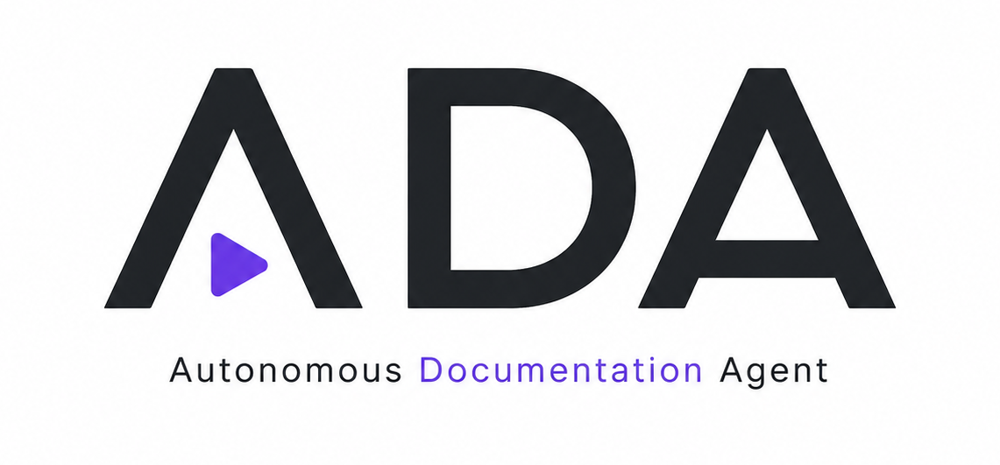

<p align="center">
  
</p>

<h1 align="center">ADA</h1>

<p align="center">
  <strong>Autonomous Documentation Agent</strong><br/>
  Automatically generates a narrated documentation video of a web app — no human involved.
</p>

<p align="center">
  
  
  
  
  
  
</p>

<p align="center">
  <em>One URL + credentials → an MP4 with narration, captions, and GSAP annotations. ~10 minutes.</em>
</p>

---

## 🎬 What ADA does

```bash
ada run --url https://app.cal.com --credentials demo@test.com:secret --output demo.mp4
```

→ ADA opens Chrome, signs in, **explores the application like a product manager**, generates a narration script, synthesizes a voice-over, and assembles everything into a ready-to-ship MP4.

**100% agentic.** No human pre-recording required, unlike Arcade / Supademo / Tango.

## ✨ Why ADA

- 🤖 **AI-driven browser piloting** — Claude Computer Use (official) or GPT-4o / Gemini via screenshot+selector
- 🎙️ **Natural multilingual voice** — ElevenLabs, OpenAI TTS, Google Cloud TTS, Fal (Kokoro), Replicate (XTTS)
- 🎞️ **HTML-native rendering** — HyperFrames produces deterministic MP4s from HTML/CSS/GSAP
- ✨ **Automatic annotations** — arrows, zooms, callouts animated on every click via GSAP
- 🛡️ **Auth + credential masking** — passwords never sent to LLMs, masked out of screenshots
- 🧪 **Full mock mode** — run the entire pipeline with no API keys (`ADA_MOCK=1`)
- 📊 **Built-in observability** — exponential-backoff retries, events.ndjson, RunReport with timings and cost
- 📜 **Open source, Apache 2.0** — no royalties, redistribution allowed

---

## 🚀 Quickstart

### No API key (mock mode)

```bash
git clone https://github.com/marcaureladj/ada.git && cd ada
pnpm install && pnpm -r build
ADA_MOCK=1 node packages/cli/dist/cli.js plan --url https://example.com --output-format json
```

### With your keys (real E2E, ~$1-2 per video)

```bash
# 1. One-time setup
pnpm playwright:install
cp .env.example .env   # fill in ANTHROPIC_API_KEY + ELEVENLABS_API_KEY

# 2. Cheap plan-only run (~$0.01)
ada plan --url https://docs.anthropic.com --output-format json

# 3. Full pipeline (~$1-2, ~10 min)
ada run --url https://docs.anthropic.com --output demo.mp4 --output-format json
```

---

## 🧠 How it works

```
┌──────────┐    ┌────────────┐    ┌──────────┐    ┌────────┐    ┌──────────┐
│ Planner  │ ─→ │ Navigator  │ ─→ │ Scripter │ ─→ │ Voicer │ ─→ │ Composer │
└──────────┘    └────────────┘    └──────────┘    └────────┘    └──────────┘
   ↑                ↑                  ↑              ↑              ↑
   Claude/         Computer Use       Claude/        ElevenLabs/   HyperFrames
   GPT-4o          + Playwright       GPT-4o         OpenAI/etc.   (HTML→MP4)
```

| Stage | Role | Output |
|---|---|---|
| **1. Planner** | Decomposes the mission into scenes (from URL + README) | `scenarios.json` |
| **2. Navigator** | Drives Playwright via Computer Use or screenshot+selector | `traces/*.json` + WebM capture + screenshots |
| **3. Scripter** | Turns traces into a narration script split into segments | `script.json` |
| **4. Voicer** | Synthesizes voice segment by segment, with cache | `audio/*.mp3` |
| **5. Composer** | Generates the HyperFrames HTML composition + runs the MP4 render | `demo.mp4` + `.srt`/`.vtt` subtitles + `.md` transcript |

The full pipeline is orchestrated in [`packages/core/src/pipeline.ts`](./packages/core/src/pipeline.ts) with **exponential-backoff retries**, an **abort signal** (clean Ctrl+C), and **structured NDJSON logging** to `events.ndjson`.

---

## 🔌 Supported providers

### 🧠 Vision (drives the browser)

<p>
  
  
  
  
</p>

| Provider | Backend | Pattern | Env |
|---|---|---|---|
| `claude-computer-use` | Anthropic Messages API + `computer_20250124` tool | Official Computer Use (mouse/keyboard) | `ANTHROPIC_API_KEY` |
| `gpt-4-vision` | OpenAI Chat Completions + image input | screenshot + JSON + selector | `OPENAI_API_KEY` |
| `gemini-vision` | Google AI Studio (direct, no GCP setup) | screenshot + JSON + selector | `GOOGLE_API_KEY` |
| `vertex-vision` | Vertex AI OpenAI-compatible endpoint | screenshot + JSON + selector | `ADA_VERTEX_API_KEY` + `ADA_VERTEX_API_URL` |

### 💬 Text (Planner / Scripter)

<p>
  
  
  
  
  
</p>

| Provider | Default model | Env |
|---|---|---|
| `claude` | `claude-sonnet-4-6` | `ANTHROPIC_API_KEY`, `ADA_CLAUDE_MODEL` |
| `openai` | `gpt-4o` | `OPENAI_API_KEY`, `ADA_OPENAI_MODEL` |
| `vertex` | `google/gemini-2.5-pro` | `ADA_VERTEX_API_KEY`, `ADA_VERTEX_API_URL`, `ADA_VERTEX_MODEL` |
| `fal` | `meta-llama/Llama-3.1-70B-Instruct` | `ADA_FAL_API_KEY`, `ADA_FAL_API_URL`, `ADA_FAL_MODEL` |
| `replicate` | `meta/llama-3.1-405b-instruct` | `ADA_REPLICATE_API_KEY`, `ADA_REPLICATE_API_URL` |
| `openai-compat` | any OpenAI-compatible endpoint (LM Studio, vLLM, OpenRouter, Ollama) | `ADA_GENERIC_API_KEY`, `ADA_GENERIC_API_URL` |

### 🎙️ TTS (Voicer)

<p>
  
  
  
  
  
</p>

| Provider | Default model | Env |
|---|---|---|
| `elevenlabs` | `eleven_multilingual_v2` | `ELEVENLABS_API_KEY` |
| `openai-tts` | `tts-1` | `OPENAI_API_KEY`, `ADA_OPENAI_TTS_MODEL` |
| `vertex-tts` | `fr-FR-Neural2-A` (fr) / `en-US-Neural2-A` (en) | `ADA_VERTEX_API_KEY`, `ADA_VERTEX_TTS_MODEL` |
| `fal-tts` | `fal-ai/kokoro` | `ADA_FAL_API_KEY`, `ADA_FAL_TTS_MODEL` |
| `replicate-tts` | `lucataco/xtts-v2` | `ADA_REPLICATE_API_KEY`, `ADA_REPLICATE_TTS_MODEL` |

### 🌐 Tech stack

<p>
  
  
  
  
  
  
</p>

---

## 🎨 HyperFrames templates

Four visual rendering templates, selectable via `--template <name>` or `output.template` in `ada.yaml`:

| Template | Format | Annotations | Description |
|---|---|---|---|
| `classic` | 16:9 | none | Full-screen capture + voice-over + minimal captions |
| `framed` | 16:9 | GSAP arrows + callouts | macOS-style browser frame, animated annotations on every click |
| `split` | 16:9 | callouts in right panel | 60/40 grid: video left, narrative script right |
| `social` | **9:16** | zoom-pulses | Vertical for Reels / TikTok, XXL animated captions |

Annotations are **automatically generated** from the Computer Use coordinates of every click, animated through a GSAP timeline that HyperFrames can seek deterministically. See [`packages/templates/src/annotations.ts`](./packages/templates/src/annotations.ts) and [`gsap-script.ts`](./packages/templates/src/gsap-script.ts).

---

## 🛡️ Security

ADA handles three sensitive categories: **screenshots**, **credentials**, **LLM context**. Guarantees:

1. **Deterministic authentication via Playwright** — passwords are filled with `page.fill()` and never sent to any LLM.
2. **Automatic screenshot masking** before each call to Claude/GPT-4o: `<input type="password">` and custom selectors (`ADA_MASK_SELECTORS=".user-email,#api-key"`) are painted over with a black rectangle.
3. **Audit log** (`audit.log` in the workdir) — every applied mask is recorded, never the masked value itself.
4. **Canary test** — a unit test verifies that a fake password never appears in `auditLog` nor on disk.
5. **Fail-fast** — missing credentials → exit code 1 with a clear message BEFORE launching Playwright/Anthropic.

See [`SECURITY.md`](./SECURITY.md) for responsible disclosure.

---

## 📊 Observability

Every run produces an `./out/<run-id>/` directory:

```
out/abc123/
├── scenarios.json     # plan generated by the Planner
├── traces/            # agent actions + WebM capture
├── screenshots/       # before/after for each action
├── script.json        # segmented narrative text
├── audio/             # MP3 per segment
├── composition/
│   └── composition.html  # HyperFrames + GSAP HTML
├── subtitles.srt
├── subtitles.vtt
├── transcript.md
├── audit.log          # credential masks applied
├── events.ndjson      # structured log (1 JSON line per event)
└── report.json        # full RunReport
```

The `RunReport` JSON looks like:

```jsonc
{
  "status": "success",
  "durationMs": 612000,
  "outputPath": "./demo.mp4",
  "stageTimings": { "planner": 4521, "navigator": 480192, "scripter": 8731 },
  "successRate": { "scenes": {"ok": 3, "failed": 0}, "actions": {"ok": 27, "failed": 1} },
  "retries": { "total": 2, "byProvider": { "anthropic": 2 } },
  "usage": { "textInputTokens": 89421, "ttsCharacters": 1840 },
  "estimatedCostUsd": 1.42,
  "eventLogPath": "./out/abc123/events.ndjson",
  "providersUsed": { "vision": "claude-computer-use", "text": "claude", "tts": "elevenlabs" },
  "errors": []
}
```

Exponential-backoff retries (3 attempts, jitter, `Retry-After` honored) on **every** API call. See [`packages/core/src/utils/retry.ts`](./packages/core/src/utils/retry.ts).

---

## 🧪 Integration tests (spec §6.2)

End-to-end suite on 5 reference open-source apps: **Cal.com**, **Plane**, **Documenso**, **Twenty**, **Formbricks**.

```bash
pnpm integration:mock         # $0,   ~30 s, CI-friendly
pnpm integration:plan         # ~$0.05, requires ANTHROPIC_API_KEY
pnpm integration:full         # ~$5-10, manual only (5 MP4s generated)
pnpm integration:aggregate    # updates tests/integration/README-RESULTS.md
```

**Spec §6.2 target**: ≥ 80% pass rate. The mock suite passes **5/5 ✓** locally. See [`tests/integration/README.md`](./tests/integration/README.md).

GitHub Actions workflow: [`.github/workflows/integration.yml`](./.github/workflows/integration.yml) — `plan-only` + `mock` on tag `v*`, `full` via manual `workflow_dispatch`.

---

## ⚙️ Configuration

### Via CLI

```bash
ada run --url https://app.cal.com \
  --credentials demo@test.com:secret \
  --output demo.mp4 \
  --template framed \
  --language fr \
  --output-format json
```

### Via `ada.yaml`

```yaml
project:
  name: MyApp
  url: https://app.cal.com
  language: fr
  description: "Open-source scheduling platform"

auth:
  type: credentials
  email: ${ADA_DEMO_EMAIL}
  password: ${ADA_DEMO_PASSWORD}

scenarios:
  - id: signup
    description: Create an account
  - id: create-event
    description: Create a 30-minute event type
    preconditions: [signup]

output:
  format: mp4
  resolution: 1080p
  ratio: '16:9'
  template: framed
  path: ./demo.mp4

providers:
  vision: claude-computer-use   # or gpt-4-vision, gemini-vision, vertex-vision
  text: claude                  # or openai, vertex, fal, replicate, openai-compat
  tts: elevenlabs               # or openai-tts, vertex-tts, fal-tts, replicate-tts
  voice: french-pro-male
```

### Environment variables

See [`.env.example`](./.env.example) — the full reference with every API key and default model.

---

## 🛠️ Architecture (monorepo)

```
packages/
├── core/         @ada/core      Types, Zod schemas, 5-stage pipeline, modules (Planner→Composer)
├── providers/    @ada/providers Vision/text/TTS adapters (Claude, OpenAI, Gemini, Vertex, Fal, Replicate, ElevenLabs)
├── templates/    @ada/templates 4 HyperFrames templates + automatic GSAP annotations
├── cli/          ada            CLI (Commander.js) — `ada` bin
└── skill/        @ada/skill     SKILL.md installable via `npx skills add marcaureladj/ada`
tests/
└── integration/  Fixtures + orchestrator + Actions workflow for the 5 OS apps
```

**Stack**: Node 22+, pnpm 9, strict TypeScript, `node --test` + `tsx`, oxlint, Prettier, Changesets.

---

## 📦 Install and build

```bash
# Prereqs: Node 22+, pnpm 9+
git clone https://github.com/marcaureladj/ada.git
cd ada
pnpm install                # + installs simple-git-hooks
pnpm -r build               # compiles every package
pnpm test                   # 146 tests via node:test + tsx
pnpm typecheck              # tsc -b --noEmit
pnpm lint                   # oxlint
```

For the first real run:

```bash
pnpm playwright:install     # downloads Chromium for Playwright
cp .env.example .env        # fill in at least ANTHROPIC_API_KEY + ELEVENLABS_API_KEY
```

---

## 🗺️ Roadmap

### ✅ v1.0 — Done (sessions 1-11)

- Complete end-to-end 5-stage pipeline
- Official Computer Use + 3 alternative vision providers
- 5 TTS providers, 6 text providers
- Auth + credential masking (canary-tested)
- 4 templates with GSAP annotations
- Robustness: retries, events.ndjson, enriched RunReport, clean Ctrl+C
- 146 tests (unit + integration)
- Multi-OS CI, Changesets ready
- 5-OS-app integration suite

### 🔜 v1.0 — Final validation

- [ ] Real run on docs.anthropic.com with your keys (runtime debug)
- [ ] GitHub push + first NPM release via Changesets
- [ ] Publish skill `marcaureladj/ada` on the Vercel Skills catalog

### 🚧 v1.1+

- [ ] Interactive mode (step-by-step validation of every scene)
- [ ] Parallel multi-language (N languages in one run)
- [ ] Mobile mode (device emulation via Playwright)
- [ ] Self-host Docker (Dockerfile + compose)
- [ ] Hosted docs (`docs.ada.dev`)
- [ ] Product landing page (meta-demo generated by ADA itself)
- [ ] Voice cloning

---

## 🤝 Contributing

See [`CONTRIBUTING.md`](./CONTRIBUTING.md) for the development workflow (prereqs, repo layout, tests, conventional commits, changesets).

All contributors agree to follow the [`CODE_OF_CONDUCT.md`](./CODE_OF_CONDUCT.md).

If you discover a vulnerability — especially in the auth / credential-masking scope — see [`SECURITY.md`](./SECURITY.md) for private disclosure via GitHub Security Advisories.

---

## 📜 Credits

- **Product spec** — [`cdc-docuvid-v2.md`](./cdc-docuvid-v2.md) — by Marc-Aurel.
- **Video engine** — [HyperFrames](https://github.com/heygen-com/hyperframes) (HeyGen, Apache 2.0).
- **Competitors and inspirations** — Arcade, Supademo, Guidde, Tango, Browser Use.

---

## 📄 License

<p>
  
</p>

Apache License 2.0 — see [`LICENSE`](./LICENSE).

Copyright © 2026 Marc-Aurel.
